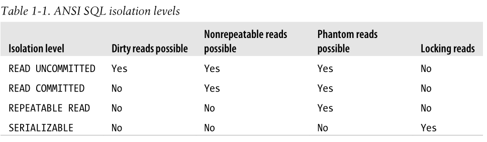

# MySQL

In this guide, we introduce some knowledge about MySQL database engine. Some knowledge may be specific to the implementation of MySQL, and not applicable to other SQL engines.

## Differences between MySQL engines - MyISAM vs InnoDB

- In production, you should almost always use InnoDB rather than MyISAM.
	- Starting from MySQL 5.5.5, InnoDB is the default engine for MySQL server.
- InnoDB supports both row-level locking and table-level locking. However, MyISAM only supports table-level locking.
- InnoDB supports transaction management, while MyISAM does not.
- InnoDB supports foreign key, while MyISAM does not.
- InnoDB uses clustered index, while MyISAM uses non-clustered index.
- InnoDB does not store the number of rows in system catalog, while MyISAM does.
	- Thus, if you run `SELECT COUNT(*) FROM my_tbl`, the query will be much faster on MyISAM.
- InnoDB supports disaster recovery much better than MyISAM.
- InnoDB requies every table to have a primary key. This is because InnoDB is an index-organized storage engine (i.e., it always uses clustered index). InnoDB indeed stores the actual data in the leaf nodes of a B+ tree index for the primary key.
	- Thus, it is wise to keep the size of the primary key small.
	- If not supplied, an implicit primary key (i.e., a counter of 6 bytes) will be created.
	- Searches on secondary index will eventually result in a search on the primary key index.
- InnoDB adds the following columns implicitly to every table:
	- `DB_TRX_ID`: the ID of the transaction which last modified this record;
	- `DB_ROLL_PTR`: a pointer to the previous version of this record _(which may be stored in undo log)_, which would be useful during rollback;
	- `DB_ROW_ID`: an auto-increment ID which could serve as the primary key if there is no explicit one;
	- `DELETED_BIT`: a flag for soft-delete of this record, while actual removal would be done by a purge worker asynchronously.

## MySQL Index

- Differences between binary tree and B tree:
	- B tree is a an n-ary tree, meaning each node could have up to n children rather than 2 children only. This is due to the nature of hard disk where data are stored in per block manner.
- Differences between B tree and B+ tree:
	- B+ tree only stores actual data in leaf nodes, not internal nodes. This makes each internal node able to contain references to more child nodes.
	- B+ tree maintains a linked list at the leaf level, so that each leaf node contains a pointer to the next leaf node. This is useful for range queries.
- Differences between clustered index and non-clustered index:
	- At leaf node level, clustered index stores data within the leaf nodes while non-clusterd index stores a pointer to the data within leaf nodes.
	- In InnoDB, primary key is alway a clustered index while other keys would always be non-clustered index.
- Differences between singular index and composite index:
	- There are 3 solutions to use B+ tree to represent composite index: 1) store hash table at each leaf node; 2) store inner B+ tree at each leaf node; 3) concatenate all columns together and use it as the key for B+ tree.
	- For composite index, the left-most prefix matching principle works when deciding whether a query is covered by an index.

## MySQL Character Set

- In production, always use `utf8mb4` as the character set for all tables.
	- Starting from MySQL 8.0, `utf8mb4` is the default character set.
- `utf8` character set is not really UTF8-compatible. It uses a maximum of 3 bytes per character.

## MySQL Concurrency, Transaction & Isolation Level

- SQL supports 4 fundamental properties: ACID (atomicity, consistency, isolation, durability).
- To ensure the atomicity and durability of a sequence of SQL statements, they have to be wrapped into an SQL transaction.
	- However, code without transaction would in general lead to better concurrency performance. We can avoid the use of transaction by careful design.
	- Each singlular statement in InnoDB is wrapped inside a transaction, to make it atomic in an intuitive way.
- According to ANSI SQL standard, there are 4 isolation levels:
	- InnoDB by default uses the _Repeatable Read_ isolation level.

- In general, there are 2 ways to achieve isolation: lock-based concurrency control and multi-version concurrency control.
	- Most modern database engines such as InnoDB adopt MVCC due to its better performance.

## MySQL High Performance & High Availability

- To ensure the high performance of MySQL servers, there are a few aspects to consider:
	- Separate read and write: use slaves as read replica;
	- Use shard to partition the database;
	- Avoid the use of lock and transaction.
- To ensure the high availablity of MySQL servers, we have to:
	- Set up a slave for every production MySQL server and the slave must be at a different geographic location;
	- Perform daily snapshot-based backup from the slave.
- MVCC (multi-version concurrency control) is useful for applications with high concurrency.
	- It is different from the traditional lock-based concurrency control.
	- The most classical use case for MVCC is the bank transfer problem.

## Differences between MySQL binlog and transaction log

- The binlog is a linear history of writes to the database, which can be used for replication purpose. For example, a slave instance will read binlog to follow its master.
- Transaction log is used for rollback and disaster recovery. It is also known as redo log in the old Oracle days.
